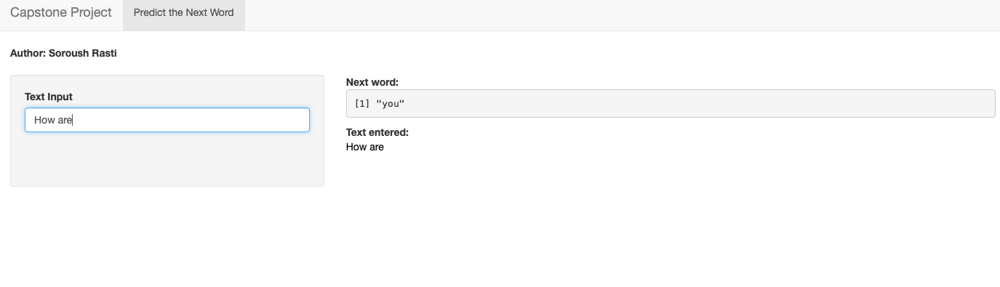

## Word Prediction App 

- An app that is able to predict what you will probaly write  as your next word.

- This app has been built based on text data in the english news, twitter and blogs resources

- Some library are used extensively for bulding this app.
Ther are include: tm, ngram, stringer

## How it works (1)

- First of all, all the input data are cleaned from punctuation, white space, stopwords and numbers
- In this app, quadgram, trigram and bigram are used which extensively increase the performance of the app

## How it works (2)

The app is working through these steps
<ol>
<li> The input sentence is cleaned as was done with the trained data
<li> The length of sentence is checked, if it is equal or more than 3 words, the last 3 words are tailed, otherwise the trigram or bigram is applied depedning on the length of the input sentence
<li> If the quad-gram could not find any result, then the sentence is decreased by one word and applied by trigram. If also trigram does not work, it goes to bi-gram. 
<li> Finanly, if no word is predicted, the most common word is proposed.
</ol>
## Shiny app

- please see the app in [here](https://soroushrasti.shinyapps.io/Data-Science-Capstone-Final-Project-master/)

- As you see in the below picture at first you put your sentence in the 'text input' field, the example here is 'How are'
- Then immediately the next words is predicted in the next word here. In this example the next word is 'you'.
- 

